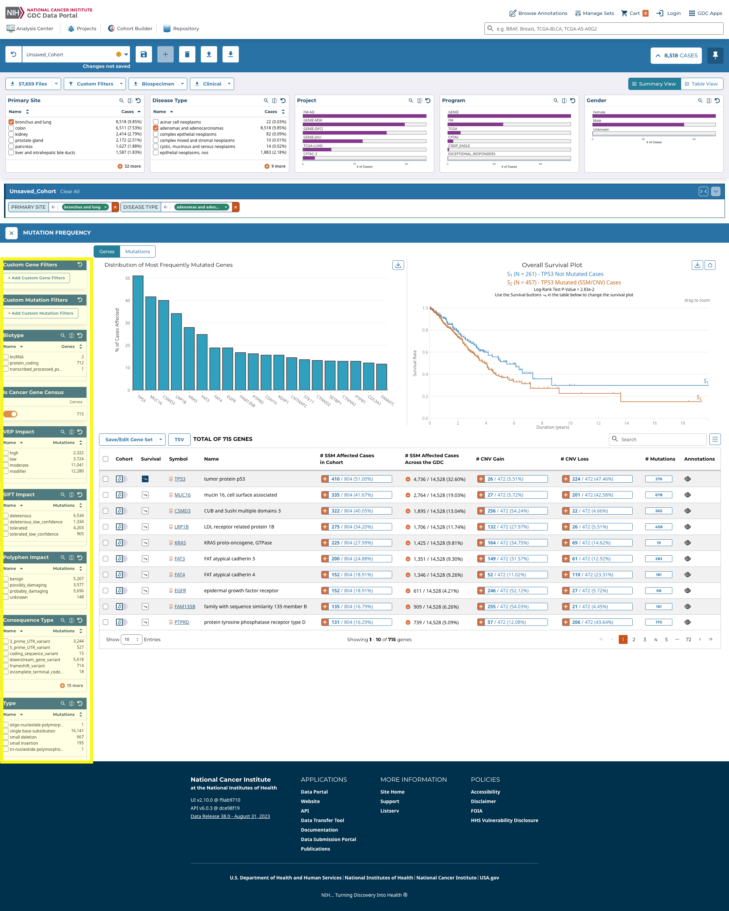
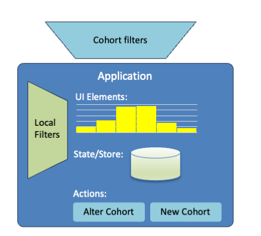
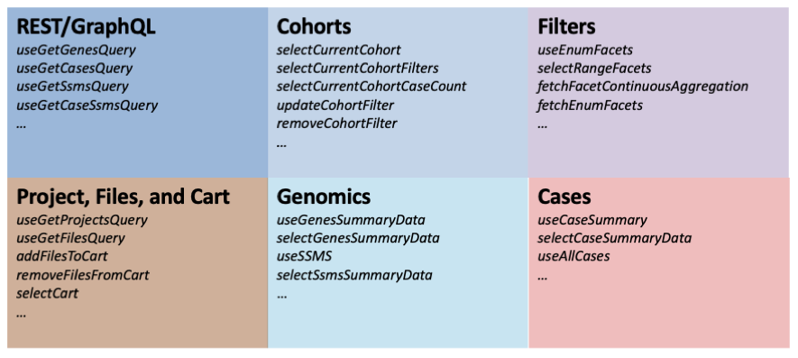
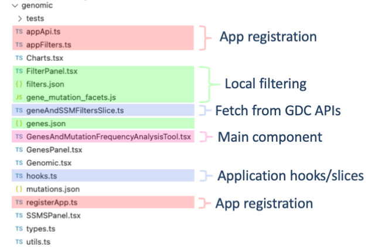

# GDC Portal Developer Guide

## Introduction

This guide will detail the process of developing applications for the GDC Portal Version 2.0. It describes the
structure of the GDC Portal, how to use the GDC Portal API, and how to develop applications for the GDC Portal.

The GDC Portal is designed to support the development of applications that allow for analysis, visualization,
and refinement of cohorts. The GDC Portal is built on top of the [GDC API](https://docs.gdc.cancer.gov/API/Users_Guide/Getting_Started/),
which provides access to the GDC data. The GDC Portal provides a framework for developing applications that
can be used to analyze and visualize data from the GDC. 

## Table of Contents

- [Introduction](#introduction)
  - [Overview of an Application](#overview-of-an-application)
  - [Local vs Global Filters](#local-vs-global-filters)
  - [Cohorts and Filters](#cohorts-and-filters)
- [Using the Portal Application API](#using-the-portal-application-api)
  - [Case Information](#case-information)
  - [File Information](#file-information)
  - [Sets: Gene, SSMS, and Case](#sets-gene-ssms-and-case)
  - [Creating a cohort](#creating-a-cohort)
  - Altering a cohort
  - Count Information
  - Component Library
    - Buttons
    - Tooltips
    - Modals
    - Charts
    - Facets
    - VerticalTable
- Application Development
  - Local Filters
  - Local State
  - Persisting State
  - Source code layout
- Sample Application
  - Project center overview
  - Local filters
  - Local Store
  - Project Table
  - Creating a new cohort
  - Registration
- [Appendix](#appendix)
  - [Using selectors and hooks](#using-selectors-and-hooks)
    - [Selectors](#selectors)
    - [Hooks](#hooks)
  - Querying the GDC API Directly

## Introduction

The GDC Portal is designed to support the development of applications that allow for analysis, visualization,
and refinement of cohorts. The GDC Portal is built on top of the [GDC API](https://docs.gdc.cancer.gov/API/Users_Guide/Getting_Started/),
which provides access to the GDC data. The GDC Portal provides a framework for developing applications that
can be used to analyze and visualize data from the GDC. The GDC Portal is built on top of the [React](https://reactjs.org/)
framework, and uses the [Redux](https://redux.js.org/) library for state management. The GDC Portal uses
NextJS to provide server-side rendering of React components. Mantine.dev is the base component library used
and styling is done with [TailwindCSS](https://tailwindcss.com/).

The GDC Portal contains a Analysis Center where application are displayed for users to use with their cohorts.
The GDC Portal also provides a framework for developing applications that can be used to analyze and visualize data from the GDC.

## Overview of an Application

Applications are High Order Components (HOC) that are rendered in the Analysis Center. The portal major functions
like Project, Downloads, and Protein Paint are all applications. Each application handles a specific task and can be used to 
refine and analyze cohorts. Applications have access to all the current cohort information and can use that information
to query the GDC API for additional information. 

Local and Cohort filters are available to applications. Local filters are filters that are specific to the application, and 
are used to refine the data that is displayed in the application. Local filters are those available from the GDC API, and are typically not the
most common. For example in the Mutation Frequency application, the local filters are the gene and mutation type filters. In the figure
below the local filters are highlighted in yellow. These filter are used to refine the input cohort allowing users to 
drill down to specific genes and mutation types of interest in the cohort.



### Local vs Global Filters

A Portal application's input can be anything including a single cohort or multiple cohorts. Application then can either add filter 
to refine the cohort by adding filters, create additional cohorts, or display the data in a visualization. Applications typlically 
have:
* local filters that are used to refine the data displayed in the application.
* UI components that are used to display the data in the application.
* State that is used to store the data displayed in the application.
* Actions that are used to update the state of the application.

Applications can also create new cohorts. These cohorts can be used by other Portal applications.



## Cohorts and Filters

From a application perspective, a cohort is a Object containing the following information:
```typescript
interface Cohort {
  id: string;        // unique id for cohort
  name: string;      // name of cohort
  filters: FilterSet; // active filters for cohort
  caseSet: CaseSetDataAndStatus; // case ids for frozen cohorts
  modified?: boolean; // flag which is set to true is modified and unsaved
  modified_datetime: string; // last time cohort was modified
  saved?: boolean; // flag indicating if cohort has been saved.
  counts: CountsDataAndStatus; //case, file, etc. counts of a cohort
}
```

Likely the most important part of the cohort is the `filters` field. The `filters` field contains the active filters for the cohort.
The `filters` field is a `FilterSet` object. The `FilterSet` object contains the active filters for the cohort. When calling either the
GDC API or GDC GraphQL API the filterset is converted to the appropriate format for the API. The `FilterSet` object is of the form:

```typescript
interface FilterSet {
  op: "and" | "or"; // operator for combining filters
  root: Record<string,Operation >; // map of filter name to filter operation
}
```
Operation are GDC API filters described in [GDC API Guide](https://docs.gdc.cancer.gov/API/Users_Guide/Search_and_Retrieval/#filters-specifying-the-query). These are:
* Equals
* NotEquals
* LessThan
* LessThanOrEquals
* GreaterThan
* GreaterThanOrEquals
* Exists
* Missing
* Includes
* Excludes
* ExcludeIfAny
* Intersection
* Union

The `root` field is a map of filter name (as defined in the GDC API) to filter operation. The filter operation can be either a single operation
or a `FilterSet` object. The `op` field will eventually support either `and` or `or`, however at this time only `and` is supported. The `and` operator is used to combine filters using the `and` operator. The `or` operator is used to combine
filters using the `or` operator. The `FilterSet` object is converted to the appropriate format for the GDC API when the cohort is saved.
When using the GDC REST API, the FilterSet can be converted into the appropriate format using the `filterSetToOperation` function. 
When using the GDC GraphQL API, the FilterSet can be using the `convertFilterSetToGraphQL` function. The API guide will provide information
on what format the filters should be in for the API. Also as the code is in TypeScript, the IDE will provide information on the format as well.


### Getting Cohort Information

The current active cohort can be accessed via the selector `selectCurrentCohort`. This selector returns the current cohort,
which is the cohort that is currently being displayed in the Cohort Management Bar. Accessing the current cohort is done via the
selector:

```typescript
import {useCoreSelector,  selectCurrentCohort } from '@gff/core';

const currentCohort = useSelector(selectCurrentCohort);
```

By using the selector, the component/application will be updated when the cohort changes. There are also selectors for getting a particular field from the cohort. For example, to get the cohort name, the selector `selectCurrentCohortName` can be used. The selectors are:


* `selectCurrentCohort`
* `selectCurrentCohortName`
* `selectCurrentCohortId`
* `selectCurrentCohortFilters`
* `selectCurrentCohortModified`
* `selectCurrentCohortModifiedDatetime`
* `selectCurrentCohortSaved`
* `selectCurrentCohortCounts`

The current active filters can be accessed via the selector `selectCurrentCohortFilters`. This selector returns the current filters,
which are the filters that are currently being displayed in the Cohort Management Bar. Accessing the current filters is done via the
selector:

```typescript
import {useCoreSelector,  selectCurrentFilters } from '@gff/core';

const currentFilters = useSelector(selectCurrentCohortFilters);
```

By using the selector, the application will be updated when the filters change. The filters are returned as a `FilterSet` object described above.

All the cohorts can be selected using the selector `selectAllCohorts`. This selector returns all the cohorts in the store. Accessing all the cohorts is done via the selector:

```typescript 
import {useCoreSelector,  selectAllCohorts } from '@gff/core';
  
const allCohorts = useSelector(selectAllCohorts);
```
# Using the Portal Application API

The GDC Portal provides a number of hooks for querying the GDC API. These hooks are located in the `@gff/core` package.
The hooks are designed to work in a manner similar to the RTL Query hooks. The hooks take arguments and return a object.
The object contains the data and the status of the query. The status of the query is stored in the `isSuccess` variable.
The @gff/core package also provides a set of selector that return values stored in the core redux store: `CoreStore`.

There are a number of hooks and selectors that are available for querying the GDC API, a subset of which are shown below:



## Case Information

The GDC Portal provides a number of hooks for querying case information. These hooks are located in the `@gff/core` package.
Cases can be queries using several different methods. The 'useAllCases' hook returns all the cases in the GDC and can be filters
by the current cohort as shown below:

```typescript
import { useCoreSelector, useAllCases } from '@gff/core';

...

const [pageSize, setPageSize] = useState(10);
const [offset, setOffset] = useState(0);
const [searchTerm, setSearchTerm] = useState<string>("");
const [sortBy, setSortBy] = useState<SortBy[]>([]);
const cohortFilters = useCoreSelector((state) =>
        selectCurrentCohortFilters(state),
);


const { data, isFetching, isSuccess, isError, pagination } = useAllCases({
  fields: [
    "case_id",
    "submitter_id",
    "primary_site",
    "disease_type",
    "project.project_id",
    "project.program.name",
    "demographic.gender",
    "demographic.race",
    "demographic.ethnicity",
    "demographic.days_to_death",
    "demographic.vital_status",
    "diagnoses.primary_diagnosis",
    "diagnoses.age_at_diagnosis",
    "summary.file_count",
    "summary.data_categories.data_category",
    "summary.data_categories.file_count",
    "summary.experimental_strategies.experimental_strategy",
    "summary.experimental_strategies.file_count",
    "files.file_id",
    "files.access",
    "files.acl",
    "files.file_name",
    "files.file_size",
    "files.state",
    "files.data_type",
  ],
  size: pageSize,
  filters: cohortFilters,
  from: offset * pageSize,
  sortBy: sortBy,
  searchTerm,
});

```
The `useAllCases` hook takes a number of arguments:
* `fields` - the fields to return from the GDC API
* `size` - the number of cases to return
* `filters` - the filters to apply to the cases
* `from` - the starting index of the cases to return
* `sortBy` - the fields to sort the cases by
* `searchTerm` - the search term to use to search the cases

This call is used in the Table view tab of the Cohort Management Bar. 

Information for a single case can be queried using the `useCaseSummary` hook. This call is used in the caseView page: 
[portal.gdc.cancer.gov/cases/5693302a-4548-4c0b-8725-0cb7c67bc4f8](https://portal.gdc.cancer.gov/cases/5693302a-4548-4c0b-8725-0cb7c67bc4f8)


```typescript

  const { data, isFetching } = useCaseSummary({
  filters: {
    content: {
      field: "case_id",
      value: case_id,
    },
    op: "=",
  },
  fields: [
    "files.access",
    "files.acl",
    "files.data_type",
    "files.file_name",
    "files.file_size",
    "files.file_id",
    "files.data_format",
    "files.state",
    "files.created_datetime",
    "files.updated_datetime",
    "files.submitter_id",
    "files.data_category",
    "files.type",
    "files.md5sum",
    "case_id",
    "submitter_id",
    "project.name",
    "disease_type",
    "project.project_id",
    "primary_site",
    "project.program.name",
    "summary.file_count",
    "summary.data_categories.file_count",
    "summary.data_categories.data_category",
    "summary.experimental_strategies.experimental_strategy",
    "summary.experimental_strategies.file_count",
    "demographic.ethnicity",
    "demographic.demographic_id",
    "demographic.gender",
    "demographic.race",
    "demographic.submitter_id",
    "demographic.days_to_birth",
    "demographic.days_to_death",
    "demographic.vital_status",
    "diagnoses.submitter_id",
    "diagnoses.diagnosis_id",
    "diagnoses.classification_of_tumor",
    "diagnoses.age_at_diagnosis",
    "diagnoses.days_to_last_follow_up",
    "diagnoses.days_to_last_known_disease_status",
    "diagnoses.days_to_recurrence",
    "diagnoses.last_known_disease_status"]
  });
```
The `useCaseSummary` hook takes a number of arguments:
* `fields` - the fields to return from the GDC API
* `filters` - the filters to apply to the cases and where the caseId is passed in

## File Information

Similar to the case information, the GDC Portal provides a number of hooks for querying file information. These hooks are located in the `@gff/core` package.
To get a list of file associated with a cohort, the `useGetFilesQuery` hook can be used. This call is used in the repository application. The repository application is used to display the files associated with a cohort. The `useGetFilesQuery` hook takes a number of arguments:

```typescript
import {
  useCoreDispatch,
  useCoreSelector,
  selectCurrentCohortFilters,
  buildCohortGqlOperator,
  joinFilters,
  useFilesSize,
} from "@gff/core";

...

const coreDispatch = useCoreDispatch();
const [sortBy, setSortBy] = useState<SortBy[]>([]); // states to handle table sorting and pagination
const [pageSize, setPageSize] = useState(20);
const [offset, setOffset] = useState(0);

const repositoryFilters = useAppSelector((state) => selectFilters(state)); // as this is a app get the repository filters from the app state (local filters)
const cohortFilters = useCoreSelector((state) =>    // get the cohort filters from the core state (global filters)
        selectCurrentCohortFilters(state),
);

const { data, isFetching, isError, isSuccess } = useGetFilesQuery({
  case_filters: buildCohortGqlOperator(cohortFilters),
  filters: buildCohortGqlOperator(repositoryFilters),
  expand: [
    "annotations", //annotations
    "cases.project", //project_id
    "cases",
  ],
  size: pageSize,
  from: offset * pageSize,
  sortBy: sortBy,
});

```

The `useGetFilesQuery` hook takes a number of arguments:
* `case_filters` - the filters to apply to the cases
* `filters` - the filters to apply to the files
* `expand` - the fields to expand
* `size` - the number of files to return
* `from` - the starting index of the files to return
* `sortBy` - the fields to sort the files by

Note this hook was designed to take global filters (e.x the current cohort as `case_filters`) and local filter (the repository filters). 

Information for a single file can be queried using the `useFileSummary` hook. This call is used in the fileView page [portal.gdc.cancer.gov/files/0b5a9e7e-8e2e-4b7a-9b7e-ff5d9c5b2b2b](https://portal.gdc.cancer.gov/files/0b5a9e7e-8e2e-4b7a-9b7e-ff5d9c5b2b2b)

```typescript
 const { data: { files } = {}, isFetching } = useGetFilesQuery({
  filters: {
    op: "=",
    content: {
      field: "file_id",
      value: setCurrentFile,
    },
  },
  expand: [
    "cases",
    "cases.annotations",
    "cases.project",
    "cases.samples",
    "cases.samples.portions",
    "cases.samples.portions.analytes",
    "cases.samples.portions.slides",
    "cases.samples.portions.analytes.aliquots",
    "associated_entities",
    "analysis",
    "analysis.input_files",
    "analysis.metadata.read_groups",
    "downstream_analyses",
    "downstream_analyses.output_files",
    "index_files",
  ],
});
```
The `useFileSummary` hook takes a number of arguments:
* `filters` - the filters to apply to the cases and where the file uuid is passed in
* `expand` - the fields to expand

## Sets: Gene, SSMS, and Case

Sets are supported by the GDC API and use to create an entity the represents a set of items as a `set_id`. Sets can be 
gene sets, SSM sets, or case sets. All GDC API's support passing sets as a filter parameter. 
The GDC Portal provides a number of hooks for creating and querying set information.

a set can be created using one of the following hooks:

* `useCreateGeneSetFromValuesMutation`
* `useCreateSsmsSetFromValuesMutation`
* `useCreateCaseSetFromValuesMutation`
* `useCreateGeneSetFromFiltersMutation`
* `useCreateSsmsSetFromFiltersMutation`
* `useCreateCaseSetFromFiltersMutation`

The will create a set from either a list of values or a filter set. The create from Values hooks take a single 
parameter `values` which is a array of values, while the create from filters hooks take one required parameter `filters`
which is a filter set or JSON object. Both calls return the created `set_id` if the set was successfully created.

As the above hook are Redux Toolkit Query hooks, namely mutation hooks, they return a tuple of the form:
`[mutationHook, response]` which is a function to call the mutation and the response from the mutation. The mutation hook can be use like:

```typescript
 const [createSet, response] = createSetHook();

  const handleCreateSet = async () => {
    const { data } = await createSet({
      variables: {
        values: ["TP53", "KRAS", "EGFR"],
      },
    });
    if (response.isSuccess) {
      dispatch(
        addSet({
          setType,
          setName: form.values.name.trim(),
          setId: response.data as string,
        }),
      );
    }
    ;
  }
 ```

Once a set is created it can be altered using the following hooks:
* `useAppendToGeneSetMutation`
* `useAppendToSsmSetMutation`
* `useRemoveFromGeneSetMutation`
* `useRemoveFromSsmSetMutation`

Set can be managed using the following actions:

* `addSet`
* `removeSet`
* `updateSet`

The following selectors are available for getting set information:

* `selectAllSets`
* `selectSetById`
* `selectSetByName`
* `selectSetByType`

Finally  the following hooks are available for querying set size:

* `useGeneSetCountsQuery`
* `useSsmSetCountsQuery`
* `useCaseSetCountsQuery`

## Creating a cohort

Depending on what your application does, you may want to create a new cohort. Although the GDC Portal SDK provides a 
number of functions for creating a new cohort. It is highly recommended that application use the provided Button and
SaveCohortModal components to create a new cohort. The Button and SaveCohortModal components are located in 
the `@gff/portal-proto` package.

To create a cohort using the SaveCohortModal component the follow code can be used:

```tsx
import React, { useState } from "react";
import { Button, Tooltip } from "@mantine/core";
import { CountsIcon } from "@/components/tailwindComponents";
import SaveCohortModal from "@/components/Modals/SaveCohortModal";

const ProjectsCohortButton = ({ pickedProjects }: { pickedProjects: string[];  }): JSX.Element => {
  const [showSaveCohort, setShowSaveCohort] = useState(false);

  return (
          <>
            <Tooltip label="Save a new cohort of cases in selected project(s)" withArrow  > 
            <span>
              <Button
                variant="outline"
                color="primary"
                disabled={pickedProjects.length == 0}
                leftIcon={
                  pickedProjects.length ? (
                          <CountsIcon $count={pickedProjects.length}>
                                  {pickedProjects.length}{" "}
                          </CountsIcon>
                ) : null
                }
                onClick={() => setShowSaveCohort(true)}
                className="border-primary data-disabled:opacity-50 data-disabled:bg-base-max data-disabled:text-primary">
                Save New Cohort
              </Button>
            </span>
          </Tooltip>
          {showSaveCohort && ( 
            <SaveCohortModal onClose={() => setShowSaveCohort(false)}
              filters={{
              mode: "and",
                      root: {
                "cases.project.project_id": {
                  operator: "includes",
                          field: "cases.project.project_id",
                          operands: pickedProjects,
                },
              },
            }} 
            />
          )}
    </>
);};
````
In summary the above code flow is:

1. The ProjectsCohortButton component renders a button with the label "Save New Cohort".
2. When the button is clicked, it sets the state variable `showSaveCohort` to true, which triggers the rendering of the `SaveCohortModal` component.
3. The `SaveCohortModal` component passed:
   * an onClose function that sets the showSaveCohort state variable to false. 
   * a filters prop, which is an object defining the filters for the cohort based on the selected projects.
4. The `SaveCohortModal` will use the passed filter to create, name and save the cohort when the save button is clicked. 

Additional details on the `SaveCohortModal` component can be found in the [Component Library](#component-library) section as
well as buttons to create a saved cohort.


## Altering a cohort

Altering a cohort is done by dispatching actions o add, remove, or clear filters. The following actions are available 
for altering the current cohort:

* `updateCohortFilter`
* `removeCohortFilter`
* `clearCohortFilters`

Note that all of these operation are applied to the current cohort. The current cohort is the cohort that is currently
being displayed in the Cohort Management Bar. The current cohort can be accessed via the `selectCurrentCohort` selector.
The current cohort's filters can be accessed via the `selectCurrentCohortFilters` selector.

#### Updating, removing, and clearing filters

to update the current selected cohort's filter, the `updateCohortFilter` action can be used. The `updateCohortFilter` action takes two arguments:
```typescript

interface UpdateFilterParams {
  field: string;
  operation: Operation;
}

```
where `field` is the field to update and `operation` is the operation to apply to the field. For example to update the 
`cases.project.project_id` field to include the project `TCGA-ACC` the following code can be used:

```typescript
import { useCoreDispatch, updateCohortFilter } from '@gff/core';

const coreDispatch = useCoreDispatch();

coreDispatch(updateCohortFilter({
  field: "cases.project.project_id",
  operation: {
    op: "in",
    content: {
      field: "cases.project.project_id",
      value: ["TCGA-ACC"],
    },
  },
}));
```

This will update the current cohort's filter to include the project `TCGA-ACC`. The `removeCohortFilter` action can be used to remove a filter from the current cohort. The `removeCohortFilter` action takes a single argument:
```typescript

interface RemoveFilterParams {
  field: string;
}

```
where `field` is the field to remove. For example to remove the `cases.project.project_id` field from the current cohort's filter the following code can be used:

```typescript
import { useCoreDispatch, removeCohortFilter } from '@gff/core';

const coreDispatch = useCoreDispatch();

coreDispatch(removeCohortFilter({
  field: "cases.project.project_id",
}));
```

This will remove the `cases.project.project_id` field from the current cohort's filter. The `clearCohortFilters` action can be used to clear all the filters from the current cohort. The `clearCohortFilters` action takes no arguments. For example to clear all the filters from the current cohort the following code can be used:

```typescript
import { useCoreDispatch, clearCohortFilters } from '@gff/core';

const coreDispatch = useCoreDispatch();

coreDispatch(clearCohortFilters());
```

This will clear all the filters from the current cohort.

#### Updating the cohort name

The cohort name can be updated using the `updateCohortName` action. The `updateCohortName` action takes a single argument:
```typescript 
  
interface UpdateCohortNameParams {
  name: string;
}

```
where `name` is the new name for the cohort. For example to update the current cohort's name to `My Cohort` the following code can be used:

```typescript
import { useCoreDispatch, updateCohortName } from '@gff/core';

const coreDispatch = useCoreDispatch();

coreDispatch(updateCohortName({
  name: "My Cohort",
}));
```

This will update the current cohort's name to `My Cohort`.

#### Setting the current cohort

The current cohort can be set using the `setCurrentCohort` action. The `setCurrentCohort` action takes a single argument:
```typescript

interface SetCurrentCohortParams {
  cohortId: string;
}

```
where `cohortId` is the id of the cohort to set as the current cohort. For example to set the cohort with id `1234` as the current cohort the following code can be used:

```typescript
import { useCoreDispatch, setCurrentCohort } from '@gff/core';

const coreDispatch = useCoreDispatch();

coreDispatch(setCurrentCohort({
  cohortId: "1234",
}));
``` 

This will set the cohort with id `1234` as the current cohort.


## Count Information

Counts information can be queried using the `useTotalCounts` hook. This hook takes a number of arguments:

```typescript
import { useTotalCounts } from "@gff/core";

const { data, isFetching, isSuccess, isError } = useTotalCounts();
```

this will return the total counts for the GDC. The data in the response is of the form:

```typescript
interface TotalCounts {
  counts: {
    caseCounts: number;
    fileCounts: number;
    genesCounts: number;
    mutationCounts: number;
    repositoryCaseCounts: number;
    projectsCounts: number;
    primarySiteCounts: number;
  },
  status: DataStatus;
}
```
where `DataStatus` is defined as:

```typescript
export type DataStatus = "uninitialized" | "pending" | "fulfilled" | "rejected";
```

## Component Library

### Buttons

### Tooltips

### Modals

### Charts

### Facets

### VerticalTable


# Application Development

## Getting started

The GDC Portal V2 is a monorepo that contains all the code for the GDC Portal. The monorepo is managed using [lerna](https://lerna.js.org) and [npm]().
The monorepo contains the following packages:

* `@gff/core` - contains the core components and hooks for the GDC Portal.
* `@gff/portal-proto` - contains the UI components and application framework (using NextJS) for the GDC Portal.

Note that the UI components are located in the `@gff/portal-proto` package will be refactored into a separate package in the future, and 
`@gff/portal-proto` will be renamed to `@gff/portal`.

You can get started by cloning the repo and following the instructions in the [README.md](https://github.com/NCI-GDC/gdc-frontend-framework/blob/develop/README.md) file.


## Source code layout



# Sample Application


# Appendix

## Using selectors and hooks

Although a complete guide to react hooks and selectors are out of scope for this document, we will provide a brief overview 
of how to use them for application development. For more information on hooks and selectors please see the 
[React Hooks](https://reactjs.org/docs/hooks-intro.html). As we are using Redux-toolkit, we will be using the calls 
describe in the [Redux Toolkit](https://redux-toolkit.js.org/tutorials/typescript) documentation.

### Selectors

Selectors are used to access the state of the GDC Portal's main redux store. Using selectors is the preferred method for
accessing the state of the GDC Portal. Selectors are functions that take the state as an argument and return a value.

```typescript
import {useCoreSelector,  selectCurrentCohort } from '@gff/core';

const currentCohort = useSelector(selectCurrentCohort);

```

The selector will return the current value of the item in the store. Consult the GDC V2 API documentation for a complete
list of selectors.

### Hooks

Fetching data from the GDC API is done via hooks. Hooks are functions that take arguments and return a value. The value
returned is typically a promise that resolves to the data requested. The GDC Portal provides a number of hooks for
fetching data from the GDC API. These hooks are located in the `@gff/core` package. 

```typescript
import { useGeneSymbol } from '@gff/core';

const { data: geneSymbolDict, isSuccess } = useGeneSymbol(
        field === "genes.gene_id" ? facetValues.map((x) => x.toString()) : [],
);
```

GDC Portal hooks are design to work simlary to the RTL Query hooks. The hooks take arguments and return a object.
The object contains the data and the status of the query. The status of the query is stored in the `isSuccess` variable.
The data returned from the query is stored in the `data` variable. The object returned from a GDC hook is of the form:

```typescript
{
  data: any;
  isSuccess: boolean;
  isLoading: boolean;
  isError: boolean;
  error: Error;
}
```

where `data` is the data returned from the query, `isSuccess` is a boolean indicating if the query was successful, `isLoading`
is a boolean indicating if the query is currently loading, `isError` is a boolean indicating if the query resulted in an error,
and `error` is the error returned from the query.

## Querying the GDC API Directly
