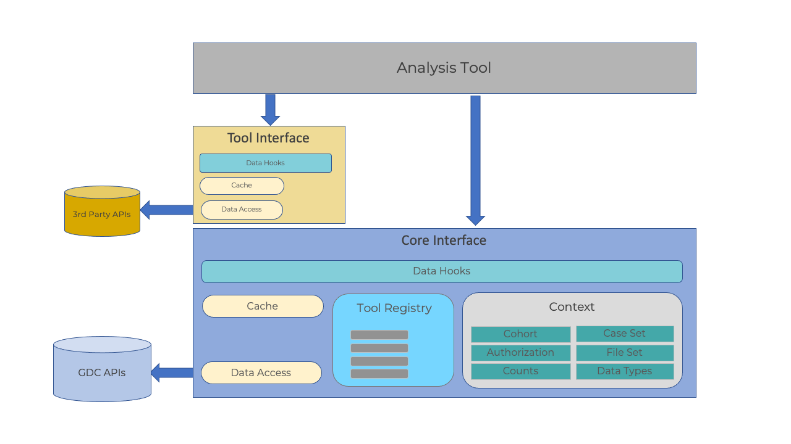

# GDC Portal V2: Analysis Tool Framework

##Overview

The Analysis Tool Framework (ATF) package is design to help integrate Analysis 
(or apps) into the GDC Portal. Built using Redux-toolkit, the ATF provides a 
redux store to cache various structures which include current cohort, 
authentication status, case and file counts, and the file cart.

This document assumes some familiarity with React and Redux, namely the 
concepts of hooks, dispatchers, and selectors.  


<p align = "center">
Figure.1 - Analysis Tool Framework's architecture.
</p>

##Core Module

The core interface module serves as an abstraction layer to the GDC API and the Frontend. 
It separates updates to the store, calls to various APIs, and cohort management from the 
frontend components. The use of hooks allows components to respond to changing in the core
state. The module is written in Typescript and makes use of Generics and other typescript features.

Applications can create their own store and context to work within the scope of an 
Analysis tool. This allows an app to maintain variables and state needed for the app without 
altering the core state. This allows developers the freedom to create custom hooks and calls to 
other APIs to support the data and functionality required by the tool.

## API Related Functions

The core module defines two functions which can retrieve data from the GDC API.

### GDC REST API

Data from the REST API can be called using ```fetchGdcEntities```

```js
fetchGdcEntities = async <T>(
  endpoint: string,
  request?: GdcApiRequest,
  fetchAll = false,
  previousHits : Record<string, any>[] = [],
): Promise<GdcApiResponse<T>>
```
where is endpoint is one of (see [gdcEndpoint](modules.md#gdcendpoint))
```
"annotations" "case_ssms" "cases" "cnv_occurrences" "cnvs" "files" 
"genes" "projects" "ssm_occurrences" "ssms"
```

The request structure (see [GdcApiRequest](interfaces/GdcApiRequest.md)) defines the parameters
to the GDI API: [Search and Retrieval](https://docs.gdc.cancer.gov/API/Users_Guide/Search_and_Retrieval/)

the ```fetchAll``` and ```previousHits``` parameters are typically not required.

### GDC GraphQL API

Likewise data from the graphQL API can be fetched using ```graphqlAPI```:

```js
graphqlAPI = async <T>(query: string, 
  variables: Record<string, unknown>
): Promise<GraphQLApiResponse<T>>
```
Where the parameters of are ```query``` which defines a graphQL query and ```variables``` as per
a typical GDC graphql request.

Both functions maye asynchronous calls to the GDC API. These functions are typically the basis for 
the creation of slices. Which are described below.

#### Type specific REST Calls
In addition to the base ```fetchGdcEntities``` there are number of type specific versions:

* [fetchGdcCases](modules.md#fetchgdccases)
* [fetchGdcFiles](modules.md#fetchgdcfiles)
* [fetchGdcProjects](modules.md#fetchgdcprojects)
* [fetchGdcAnnotations](modules.md#fetchgdcannotations)

These will call the corresponding API endpoint with the appropriate parameters and return the data into a 
specific response type.

The API function are typically used to define a fetch function using ```createAsyncThunk``` for example:

```js
export const fetchFiles = createAsyncThunk<
  GdcApiResponse<FileDefaults>,
  GdcApiRequest,
  { dispatch: CoreDispatch; state: CoreState }
>("files/fetchFiles", async (request?: GdcApiRequest) => {
  return await fetchGdcFiles(request);
});
```
This in turn used to by ```createSlice``` in the extraReducer section to 
handle the ```fulfilled```, ```pending```, and ```rejected``` states.

```js
const slice = createSlice({
  name: "files",
  initialState,
  reducers: {},
  extraReducers: (builder) => {
    builder
      .addCase(fetchFiles.fulfilled, (state, action) => {
        const response = action.payload;
        if (response.warnings && Object.keys(response.warnings).length > 0) {
          state.files = [];
          state.status = "rejected";
          state.error = Object.values(response.warnings)[0]; // TODO add better errors parsing
        } else {
          state.files = response.data.hits.map((hit) => {
            return ({
              id: hit.id,
              ...
              ...
          });
          state.status = "fulfilled";
          state.error = undefined;
        }
      })
      .addCase(fetchFiles.pending, (state) => {
        state.files = [];
        state.status = "pending";
        state.error = undefined;
      })
      .addCase(fetchFiles.rejected, (state) => {
        state.files = [];
        state.status = "rejected";
        state.error = undefined; 
      });
  },
```

### Selectors

Selectors are used to select a slice of the store to return the relevant part of the
store’s current data. Using the slice create above, the files section of the CoreStore
can be created with:
```js
export const selectFiles = (
  state: CoreState,
): ReadonlyArray<GdcFile> | undefined => state.files.files;
```

### Hooks

The fetch function is to build a core data hook using ```createUseCoreDataHook``` which will 
dispatch the fetch call and return the status and data in a component. The Core module 
defines a number of these data hooks, which are described below.

A hook is created by:
```js
import { createUseCoreDataHook, createUseFiltersCoreDataHook } from "../../dataAcess";
import { fetchFiles, selectFilesData } from "./filesSlice";
import { selectCurrentCohortFilters } from "../cohort/cohortFilterSlice";

export const useFiles = createUseCoreDataHook(fetchFiles, selectFilesData);
```

The Core module also defines ```CoreDispatch``` and ```CoreState``` that 
are used to dispatch exported actions defined by the core reducers.

The hooks, selectors, actions, CoreDispatch, and CoreStore are the basic elements of the 
Data Access Layer. The layer provides type specific elements needed by the GDC Portal 
and analysis tools.  

### Cohort
Cohort management includes defining cohorts by a set of filters which are used to return
cases and files from the GDC APIs.

####Actions
* [updateCohortFilter](modules.md#updatecohortfilter)
* [removeCohortFilter](modules.md#removecohortfilter)
* [clearCohortFilters](modules.md#clearcohortfilters)
* [setCurrentCohort](modules.md#setcurrentcohort)
* [clearCurrentCohort](modules.md#clearcurrentcohort)

####Selectors
* [selectCurrentCohortFilters](modules.md#selectcurrentcohortfilters)
* [selectCurrentCohortFilterSet](modules.md#selectcurrentcohortfilterset)
* [selectCurrentCohortCaseGqlFilters](modules.md#selectcurrentcohortcasegqlfilters)
* [selectCurrentCohortFiltersByName](modules.md#selectcurrentcohortfiltersbyname)
* [selectCurrentCohort](modules.md#selectcurrentcohort)
* [selectCohortCounts](modules.md#selectcohortcounts)
* [selectCohortCountsByName](modules.md#selectcohortcountsbyname)
####Hooks
* [useCohortCounts](modules.md#usecohortcounts)
* [useFilteredCohortCounts](modules.md#usefilteredcohortcounts)
####Functions to add:
Cohort management and persistence
### Cohort Builder Facets
####Selectors
* [selectCaseFacets](modules.md#selectcasefacets)
* [selectCaseFacetByField](modules.md#selectcasefacetbyfield)
* [selectFilesFacets](modules.md#selectfilesfacets)
* [selectFilesFacetByField](modules.md#selectfilesfacetbyfield)
* [selectGenesFacets](modules.md#selectgenesfacets)
* [selectGenesFacetByField](modules.md#selectgenesfacetbyfield)
* [selectMutationsFacets](modules.md#selectmutationsfacets)
* [selectMutationsFacetByField](modules.md#selectmutationsfacetbyfield)
### Files
####Selectors
* [selectFiles](modules.md#selectfiles)
* [selectFilesData](modules.md#selectfilesdata)
####Hooks
* [useFiles](modules.md#usefiles)
* [useFilteredFiles](modules.md#usefilteredfiles)
### Cases
####Selector
* [selectCases](modules.md#selectcases)
* [selectCasesData](modules.md#selectcasesdata)
### Projects
####Selectors
* [selectProjectsState](modules.md#selectprojectsstate)
* [selectProjects](modules.md#selectprojects)
* [selectProjectsData](modules.md#selectprojectsdata)
####Hooks
* [useProjects](modules.md#useprojects)
### SurvivalPlot
####Selectors
* [selectSurvivalState](modules.md#selectsurvivalstate)
* [selectSurvival](modules.md#selectsurvival)
* [selectSurvivalData](modules.md#selectsurvivaldata)
####Hooks
* [useSurvivalPlot](modules.md#usesurvivalplot)
### Projects
####Session
####Actions
* [setSessionId](modules.md#setsessionid)
####Selectors
* [selectSessionId](modules.md#selectsessionid)
### Genomics
####Actions
* [updateGenomicFilter](modules.md#updategenomicfilter)
* [removeGenomicFilter](modules.md#removegenomicfilter)
* [clearGenomicFilters](modules.md#cleargenomicfilters)
####Selectors
* [selectGenomicGqlFilters](modules.md#selectgenomicgqlfilters)
* [selectGenomicFiltersByName](modules.md#selectgenomicfiltersbyname)
#### Genes
####Selectors
* [selectGeneFrequencyChartState](modules.md#selectgenefrequencychartstate)
* [selectGeneFrequencyChartData](modules.md#selectgenefrequencychartdata)
* [selectGenesTableState](modules.md#selectgenestablestate)
* [selectGenesTableData](modules.md#selectgenestabledata)
####Hooks
* [useGeneFrequencyChart](modules.md#usegenefrequencychart)
* [useGenesTable](modules.md#usegenestable)
#### SSMS
####Selectors
* [selectSsmsTableState](modules.md#selectssmstablestate)
* [selectSsmsTableData](modules.md#selectssmstabledata)
####Hooks
* [useSsmsTable](modules.md#usessmstable)
### Authorization
TODO
### Cart
TODO
### Images
####Selectors
* [selectImageDetailsInfo](modules.md#selectimagedetailsinfo)
* ####Hooks
* [useImageDetails](modules.md#useimagedetails)
####TODO
Slide image data
### Annotations
####Selectors
* [selectAnnotationsState](modules.md#selectannotationsstate)
* [selectAnnotations](modules.md#selectannotations)
* [selectAnnotationsData](modules.md#selectannotationsdata)
####Hooks
* [useAnnotations](modules.md#useannotations)
### Cancer Distribution
####Selectors
* [selectCnvPlotData](modules.md#selectcnvplotdata)
* [selectSsmPlotData](modules.md#selectssmplotdata)
####Hooks
* [useCnvPlot](modules.md#usecnvplot)
* [useSsmPlot](modules.md#usessmplot)
### Oncogrid
####Selectors
* [selectOncoGridData](modules.md#selectoncogriddata)
####Hooks
* [useOncoGrid](modules.md#useoncogrid)


##[API Documentation](api/modules.md)

